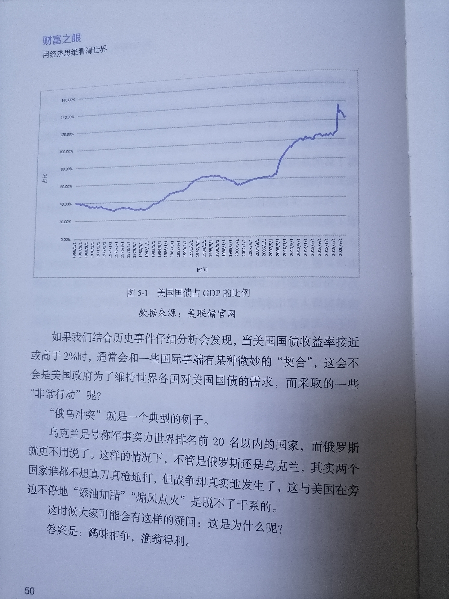
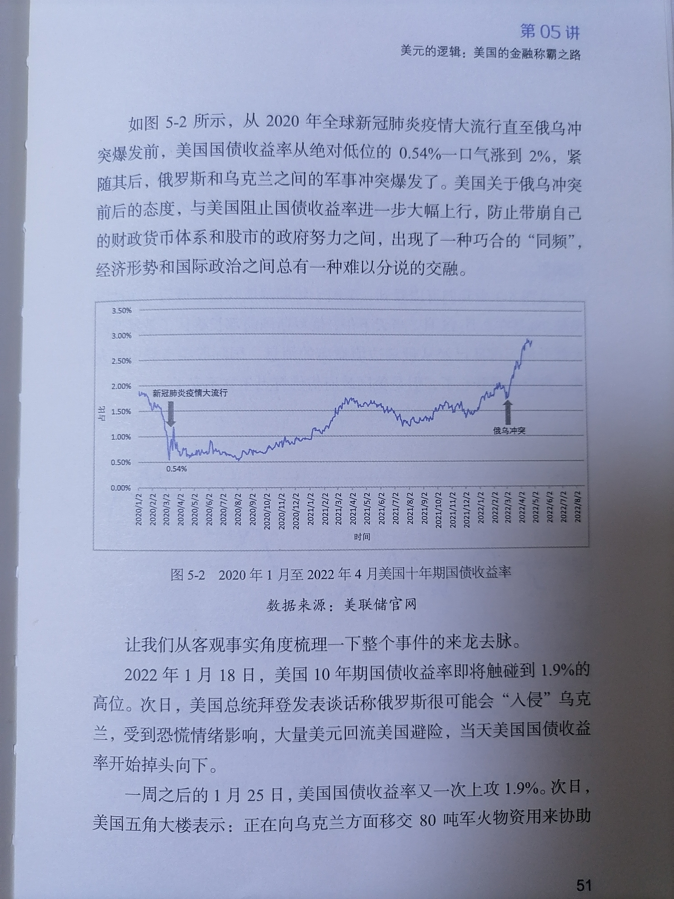
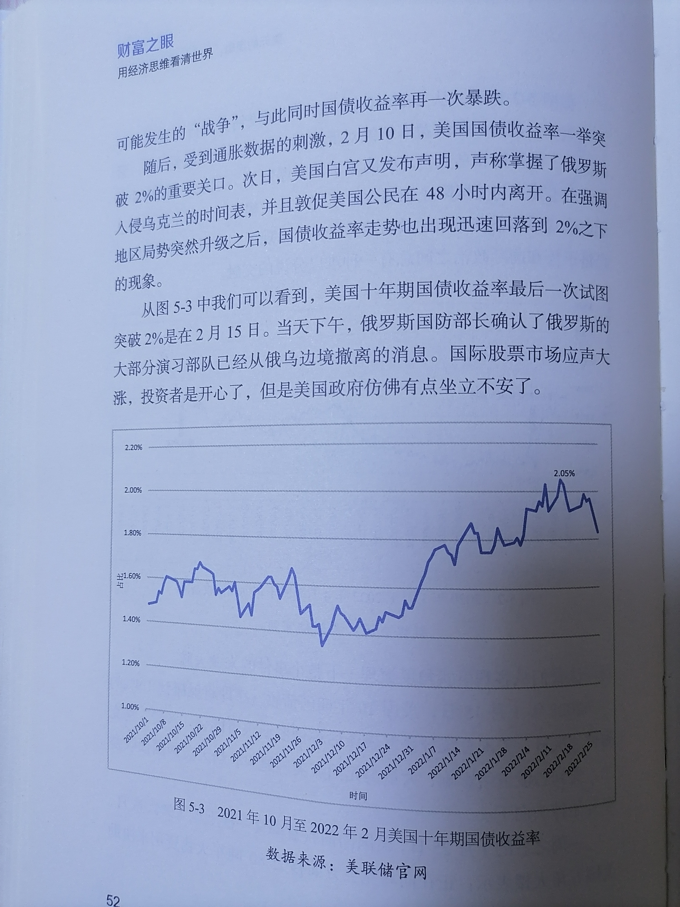

# economics

## 财富之眼-用经济思维看清世界
### 康波周期：一个关于财富的秘密
`经济运行背后是否有一只"无形之手"？人的命运是否在出生之日就有了注定的轨道？到底是"三分天注定，七分靠打拼"，还是反之？这些并不是无从考据的，康波周期，这个值得我们去研究的经济现象在历史的进程中循环往复地拨弄着财富的指针，见证着时代的潮起潮落。`
#### 为什么"猪都能飞起来

`一个1982年出生的北京小伙子，2007年刚好25岁，需要结婚，如果不出意外，丈母娘会"逼"着他买一套北京的婚房。十几年后的今天，可能仅仅靠这套房产，他就已经身价近千万元了。
2003年左右，叱咤风云的富豪们是清一色的煤老板，这并不意味看他们的个人能力有多厉害，而是他们进入市场的时间节点恰好踩在了康波周期过度建设期的初始阶段﹣﹣全球的大宗商品60年一遇的牛市，外加中国如火如茶的基础设施建设，以及地产开发，不论是电力还是炼钢，都离不开煤的深度参与。
就像雷军曾说过的那句"站在风口上，猪都能飞起来"。那么"猪"是靠着怎样的"风口"规律飞起来的呢？
地球有四季交替的规律，宏观经济也天然蕴含着规律性。目前，主流的经济周期理论都以中短期为主，比如代表库存流转的4年基钦周期，代表设备更迭的10年朱格拉周期，代表地产建筑业的15年库兹涅茨周期。然而，一旦涉及更长的时间范围，周期预测就会因为受到太多变量干扰而变得困难重重，所以经济学界才有这么一句话：经济有规律，经济无周期。
但是偏偏有这么一个苏联经济学领域的怪才﹣﹣康德拉季耶夫，他基于对英、美、法、德等国一百四十余个样本进行统计分析，在1923年提出了"长波经济周期假设"，然后以此为基础，创立了一个时间跨度最长的经济周期模型。这个以60年为尺度的康德拉季耶夫波动周期简称为"康波周期"。
从美国20世纪60年代末开始的滞胀到日本失去的三十年，从20世纪90年代中期至千禧之交的互联网泡沫，到2008年次贷危机，其至中国2008年开始的地产黄金时代，这些经济大事件几乎都能在康波周期中找到注解和预判，以至于中国金融周期大师周金涛曾感叹"人生发财靠康波"。只要踩准一次康波上升周期，你就得到了迅速完成家庭财富积累和人生跨越的门票。
这个康波周期到底是什么？让我们先从理论本身说起。
康德拉季耶夫分析了欧美国家近两百年的经济发展变化，认为在发达的商品经济体系中，在技术创新的带动和商品价格波动叠加下，大约每六十年一甲子是一个完整的循环周期。这可以分为5个时期，如图19-1所示，（分别是：衰退期、再投资期、繁荣期、过度建设期和混乱期。混乱期的结束就意味着衰退期的到来，从而实现一个完整的循环。`

`在衰退期，经济萎靡不振，金融萧条，消费乏力；到了再投资期时，蛰伏的资本缓慢复苏，新科技开始在制造业上显现出催化作用。随着社会不断复苏，经济发展速度逐渐转入快车道，于是再投资期的尾部就会迎来繁荣期；当繁荣期时的乐观情绪到达顶峰，就进人了过度建设时期，这期问人们投资风险偏好日益激进，股价飙涨，大宗商品价格走牛；随后到来的就是混乱期，投机性交易充斥金融资本市场，空头缴械投降；而当过高的资产价格进行价值回归时，金融泡沫随即破裂，于是衰退期再次到来，形成新的康波循环。
有些人可能觉得这个规律似曾相识，没错，后来大名鼎鼎的美林资产时钟就是依拖康波周期做的简化模型，如图19-2所示。`

#### 新一轮康波周期中国家和个人机遇
按照康波周期来计算，新一轮的康波周期上升阶段将在2025年左右开启，而技术革命在这一阶段起着关键性作用。2021年至2025年是中国第十四个"五年计划"建设时期，也是全球经济因为新冠肺炎疫情造成停滞甚至萧条的关键恢复时期。
在此关键时期，中国提出了逐步形成以国内大循环为主体、国内国际双循环相互促进的新发展格局。中国经济增长中的消费正在成为主要驱动力量，而出口在中国经济总量中的比重下降到了17.4%。2019年，中国经济总量的82.6％来自国内，表明中国经济结构具有伸缩性，已经具备内生力量。现在，距离实现第二个百年目标还有20多年时间，正好与新康波周期的上升阶段重合。面对新时代的百年变局，历史给予了中国技术革命难得的战略机遇期。
一个以60年为尺度的规律，在运行百年后，依然可以将误差控制在5年内，确实足以令人惊叹。

所谓"人生发财靠康波"，绝不是夸大其词。每个人理论上一辈子能遇到2~4次康波上升期，但因为个人所处的年龄段不同，第一次太小，最后一次太老，所以真正能参与的就只有一两次机会。回到开头那个例子，对于1975年之后1985年之前出生的人，2005年开始的过度建设期正是他们步入社会的时候。正如前面所说，只要在刚踏人社会的时候在大城市买到了房子的人，现在基本都是财富自由的人生赢家。而对1985年至1995年出生的人，房子已经不再是最优解，并不是房子不值钱，而是很多人没有看懂买房子的本质。
得到一个稳定的居所只是买房子的一个目的，甚至不是最重要的目的，真正的目的是通过房产进行贷款，30%~40％的首付相当于得到大概3倍杠杆。某些地区甚至施行首套房20％首付的优惠政策，这个天然的5倍杠杆已经是普通人能接触到的金融杠杆的极限。然而，当前资产价格全部都在高位的时候，再加5倍杠杆显然不是什么好主意。
美国开始加息缩表以后，不断攀升的住房贷款利率再次给房地产市场降温。基于本讲的分析，2025年至2050年是新康波周期的上升阶段，世界经济应该会出现高速增长。所以"85后"这批人的第一次重要致富机会大概率会出现在2025年左右，也就是美国加息周期结束前后。那时，优质资产经过多年的价格通缩、资本抽水和恐慌性抛售之后，价格非常可能会回归合理区间。
在每轮周期的不同阶段，都有一个收益率领跑其他种类的大类资产。比如经济滞胀期中的现金类资产，由于防守型价值的存在，是优于债券、股票和大宗商品的投资选择；一旦进入经济衰退期，我们则更需要持有固定利率的债券来对抗市场利率的下跌；在经济复苏时期，股票会迎来周期性增长，尤其是押注引领技术革新的企业，这无异于是踩到牛市的节奏。

#### 美国金融称霸之路：黄金美元、石油美元、信用美元

`黄金美元时期：
在布雷顿森林体系下，美元与黄金挂钩，其他国家的货币通过固定汇率与美元挂钩。这使得美国在国际贸易和金融中占据主导地位，其他国家需要持有美元作为储备货币。

石油美元时期：
在20世纪70年代初，美国与沙特阿拉伯等主要石油出口国的交易中达成了一项协议，称为“石油美元协定”。根据协议，石油出口国同意将其原油销售收入主要用美元结算，并将相应的石油储备投资于美国资产市场。
这一协定对于美国来说具有重大意义，因为它导致了全球石油贸易对于美元的巨大需求。石油在全球经济中的重要地位使得美元在全球贸易和金融体系中的地位更加稳固。

信用美元时期：
随着全球金融市场的发展和国际贸易的扩大，美元的地位逐渐转向信用基础上的霸主地位，即信用美元。美国“信用”的基石，说到底还是它的科技、经济以及军事实力，美国债券市场和美国国债成为全球投资者的首选，美元作为全球储备货币的地位进一步加强。`

#### 收割世界财富的美元潮汐
`在了解了美国的货币霸权之路后，我们再来看看美元是如何在各个国家形成环流的。
在全球化产业链的分工体系中，可以分为三类国家，消费国、生产国和资源国。消费国主要是美国和南欧各国，生产国的典型代表是中国、日本、韩国等，而资源国以俄罗斯、中东石油国家、巴西等为主。
作为消费国的美国，会向生产国输出美元资本，主要表现为外商直接投资。而生产国的企业在拿到资本和项目后，会去资源国采购原材料进行生产，产品生产完后卖给美国等消费国，美国向生产国支付美元作为货款结算。
生产国拿到了美国支付的美元，想去购买美国的核心优质资产，美国是肯定不会卖的，所以就只能选择购买低息的美国国债（详见本书第09讲"中国的外汇储备之谜")。而美国拿到生产国通过购买低息美国国债流回的美元，会到生产国进行再投资和控制生产国的优质资产，以获得高额的投资收益，由此美元流出美国。
可见，消费国、生产国、资源国之间的美元环流就这么建立起来了。那么，美国是如何在这个环流中制造"潮汐"来收割世界财富的呢？
复盘历史经验，这个收割套路可以分为三步：
第一步，美国会实施宽松的货币政策，大量超发货币。这个时候，美联储扮演着洪水制造者的角色，向全世界大放水，即全球的美元供给剧增。而实业资本家们、华尔街的金融大鳄们拿着大笔美元进行海外投资，疯狂购买国外的商品、房地产、股票、债券等各类资产。美元流人国的资产价格会在短期内急速攀升，房价、股价等大涨，由此产生资产泡沫。
第二步，随着大批资本涌入，美元流入国的资产严重泡沫化，美联储就开始加息缩表（减少美元供应量）。有时，甚至采用在其他国家和地区制造动乱等各种手段，驱使美元资金出逃。此时华尔街的资本家们也开始了表演，在高位时疯狂抛售各类资产，国际资本像潮水一样迅速退去，大量美元回流美国。
第三步，加息周期下的美元不断升值走强，相对应地，其他国家的货币开始贬值，资产价格缩水。而此前的资金大规模流出，也使得这些国家的资产泡沫破裂，处于高位的房价和股价往往大跌，最终跌成了白菜价。在一地鸡毛之后，撤离的美元再来个"回马枪"-﹣在资产价格压缩到极限时，美元再次卷土重来，大肆抄底这些国家便宜又优质的资产。从中赚取的巨额利润差价，使得美国的资本家们赚得盆满钵满。
一个轮回，先放水，再收水，有人叫它"美元周期"，也有人叫它"美元潮汐"。而最后的结果是，经历资产价格泡沫破裂的国家很容易一蹶不振，而美国却完成了一次对这个国家的"收割"。这样的收割方式，美国屡试不爽，比如1997年的亚洲金融危机就是这样产生的（详见本书第20讲"1997年亚洲金融危机")。`
#### 超发的美元寻找资本的"蓄水池"
`美元潮汐，看起来只是一放一收，操作似乎很简单，但其关键点就在于寻找资本蓄水池。我们以第一轮美元潮汐的实践地拉丁美洲来举例。
说起拉丁美洲，步入21世纪，大家对它的印象可能大多是贫穷、混乱，但在20世纪60、70年代，拉丁美洲还是有段繁荣时光的。二战后，美国在政治上扶持拉丁美洲的亲美势力上台，高呼"消除贸易壁垒"的 口号，想方设法诱使拉美国家实行资本自由化，以使美国金融资本自由出入，这是美元潮汐形成的关键一步。
随后，美国以援助拉美国家发展为由，向多个拉美国家诸如智利、巴西、阿根廷等投放大量美元，美其名曰海外投资。由于美国资本的不断流入，表面上，拉美的经济一派繁荣，然而，危机的种子已经悄然埋下。在当时，没有人觉得借美元发展经济有什么问题。
1979年，美国开启了收割的第二步。一方面美联储不断加息，导致大量美元回流；另一方面制造拉美地区矛盾，大量在拉美的美国资本撤资回国，拉美国家的资产泡沫瞬间破裂。由此，拉丁美洲各国的资本流动性枯竭、资金链断裂、投资环境恶化。智利、墨西哥、阿根廷等国纷纷遭遇主权债务危机，还不起钱的国家只能以资源抵债。美国顺利地将这些国家优质的矿山、油田等收入囊中。
拉丁美洲接受美国金融资本的自由出入，实际上就使得大放水的`
#### 美国政府的"欠条"：美债
`聊完美元如何"收割世界财富"，让我们再聊聊"美债"-﹣这个"收割"过程中的"利器"。
美债，即美国国债，是以美国联邦政府信用为担保的债券。1789年新组建的美国联邦政府承接了历史积存债务，形成了第一批美国国债。美国国债是美联储实施公开市场操作的主要操作品种，也是金融市场中一种重要且常用的抵押品。
美国国债根据债券的偿还期限不同，大致可分为短期（1年以下）、中期（1~10年）和期（10年以上）3类。一般来说，期限越长，美国国债的票面利率就越高。因为时间越长，不确定的风险越大，作为补偿的风险溢价（票面利率）就会越高。
总结起来就是，当美国国债的需求增加时，出现供不应求的状况，美国国债的交易价格就会提高，而美国国债收益率就会下降；而当美国国债的需求减少时，大家纷纷卖出美国国债去买其他金融资产，那么美国国债的交易价格就会下降，美国国债收益率就会上升。
美国国债收益率也一直是全球投资界时刻关注的重要指标，国际上通常将10年期美国国债收益率当作无风险投资利率，也被称为"资产价格锚定物"。全球其他的金融资产、商业资产的利润率，就自然会被投资人拉出来和美国国债收益率进行比较。因此，"不赚不赔"并不是衡量企业盈利能力的零轴，10年期美国国债的收益率才是真正的零轴。`
#### 美元的逻辑到底是什么
`当美国国债收益率持续走高时，根据前文的分析，就意味着市场对美国国债的需求在下降，世界各国不愿意继续买美国国债这个避险资产了。那么，美国国债﹣﹣美国向世界融资的工具也就失去了它的作用，这对美国政府而言可不是什么好事。
从图5-1可以看到，近一百年来，美国国债占 GDP 的比重节节攀升，债台高筑的美国政府似乎靠着"打欠条"过日子。`

#### 人民币、美元、中国楼市和美国通胀
`人民币、美元、中国楼市和美国通胀，有什么联系？我们首先需要了解一下经济学中非常有名的费雪方程式：
 MV = PO 
在这个公式中， M 表示货币量， V 表示货币流通速度， P 表示价格水平， Q 表示交易的商品总量。由该方程式我们可以看出：在 V 、 Q 比较稳定时，货币流通量 M 决定着物价水平 Po 
同样的道理，假设世界上各个经济体都是封闭的、独立运转的，在各国货币流通速度不变的情况下，根据费雪方程式，像美国那样无限制"印"钞的结果，必然就是商品和劳务价格的无限上涨。
但是，现实并非这样。
当今世界真正闭关锁国的经济体是极少数的，在美国主导的"全球化"之下，美国国内的货币供应量远远小于美国"印"出来的钞票。`
#### 一进一出：美国控制物价的关键
`美国既有超发美元的动机，又有控制物价的现实需求。在第05讲"美元的逻辑：美国的金融称霸之路"中提到，美国靠着美元霸权和发行美债，将通胀的压力转移到其他国家，而美国国内既获得了从世界各国进口的物美价廉的产品，又维持了美元的价值和购买力。
美元霸权形成的过程，也是美国持续向全球市场输出美元的过程。无论美国发行多少货币，只要其他国家对美元有持续和稳定的持有需求，美国就可以用"印"出来的钞票购买全世界的商品，供自己居民消费。
按照这样的操作，美国就成功将超发货币和通胀压力输出到了其他国家，并且通过商品购买获得了诸多好处。而美国只有3亿多人口，只要不像津巴布韦、委内瑞拉那样，极其夸张地印发钞票，全世界发展中国家"供养"美国的模式仍然可以持续下去。
以费雪方程式的思路解释，美国就是"输出信用货币（ M 减少）＋输入消费品（ Q 增加）"，这"一进一出"就成了美国控制国内价格水平的关键！`

#### 花不出去的美元

`2001年，中国加入世界贸易组织（ WTO )，中国改革开放进入新的历史阶段。之后，中国充分发挥劳动力资源和规模生产等优势，设立各类工厂，正式确立了"出口导向型"的经济模式，开始大量出口服装、日用品、钢材等产品。通过对外贸易，中国积累了大量的外汇储备。
2001到2005年，短短四年时间里，中国的外汇储备就从约2000亿美元猛涨到8000亿美元以上(图7-1)，这是第一个台阶。那么，如此天量的外汇储备为什么不考虑用出去呢？
不是不想用，是因为买不到真正想要的东西，或者说买不到那么多想要的东西。就拿日常消费品来说，由于当时中国具有消费品生产方面的成本优势，产能也非常充足，大可不必将外汇储备用于进口这类商品。中国希望购买高科技公司股权、高端数码机床等高价值的东西，但发达国家概不出售这些产品。不仅如此，美国还向其同盟国表示：向中国出售先进技术和产品者，会受到制裁！
即便如此，中国在对外直接投资的道路上也做了诸多探索。改革开放以来，中国企业在参与国际经济合作与竞争的过程中一直坚持"走出去"的战略。
必须要强调的一个事实是，即使有越来越多的优质海外投资项目可供中国的企业投资，但数量总是有限的，远远无法匹配中国快速积累的外汇储备金额。从2010年开始，中国持有的美国国债规模维持在1.1万亿美元左右，这得要多少投资项目才能承接这么大一笔钱？就算是把外汇储备都存在银行，世界上也没有哪家银行可以接下这么大一笔存款。全球大宗商品、房地产和股票市场也是一样，"池子"太小，根本容不下中国外汇储备这条"大鱼"。况且，这类资产也没有稳定的价格预期，都不是外汇储备适合的投资方式。所以，在当时，中国的外汇注定会形成"赚得多，花得少"的局面。
事实上，除了石油、铁矿石等大宗商品，中国相当规模的外汇结余是没有合适的进口用途的。`
#### 2008年那场金融危机，对中国意味着什么
`正当中国手里攥着大量美元花不出去的时候，2008年金融危机来了。
美国为了刺激经济，开启了长达六年的量化宽松（从2008年底至2014年10月，美联储先后出台三轮量化宽松政策），即美联储在实行零利率或近似零利率政策后，通过购买国债等中长期债券，增加基础货币供给，向市场注人大量流动性资金（"现代货币理论"的实践）。
这个过程可以简单直接地理解为增印美元钞票。
但实际上，美国的量化宽松并没有带来明显的通胀，其中也有上文提及的这个原因，中国及时向美国出口的廉价商品，帮助其维持了较低的物价水平。
对于2008年的金融危机，中国当时该不该帮助全世界拯救经济呢？当然该救，因为那次金融危机爆发时，中国成为"世界工厂"没几年，需要别人更多地"光顾"。所以那时候不仅仅是救美国，更是自救。如果不救美国，中国刚建好的大量工厂很可能会失去后续订单。
2008年金融危机，中国为世界经济做出了重要贡献，伴随而来的，是中国的外汇储备也上了第二个台阶。回看图7-1,2008年﹣2014年，中国的外汇储备继续快速上升。
中国的外汇储备多了，就意味着需要在中国境内发行等量的人民币，因为企业出口换来的美元不可能在中国花，需要在央行把美元换成人民币（详见本书第08讲"牵动市场心弦的货币政策")。2012年，中国取消了强制结汇制度，但外汇占款依然是央行最主要的资产。
中国在对外输出商品时相当于在对内输入货币，这与上文所说的美国输入商品、输出货币的模式恰恰相反。
再回头看费雪公式， MV = PQ 。当中国向境外输出商品时，境内商品交易量减少， Q 下降；向国内输入货币，对应 M 升高。在货币流通速度 V 稳定的情况下，物价 P 的上涨，就会成为必然。此时，摆在中国经济面前的一道难题就是，如何为增加的货币供给找到去向和出口，来保证物价不会出现暴涨。
房地产市场在最需要它的时候，再次"不辱使命"。`
#### 中国房地产市场的使命：危机中自救
`全球的房子都有部分金融属性，这是客观事实。既然房子有金融属性，那就不像一般消费品，能靠着降价来去库存。例如，带有金融属性的股票，越涨越有人买。)
这是房地产和一般消费品的本质差异。
房地产的部分金融属性，和2008年金融危机后中国过多的货币供给"一拍即合"，于是，我们看到了后金融危机时代，普遍上涨的房价和房地产业的蓬勃发展。
社会各个阶层的财富相当部分变成了房子，费雪公式右边" P （价格水平） xQ （商品交易量）"中很大一部分就表现为房地产市场巨大的成交额。虽然当时也出现了"蒜你狠""姜你军"等个别消费品的价格上涨现象，但总体来说，中国并没有经历长时间、大规模持续的全面通胀，房地产"量价齐升"所带来的抵消作用功不可没"。
充当"蓄水池"，是房地产行业在中国外向型经济模式中的使命和任务。当然，房地产行业能担任这个角色，离不开全社会对"房价永远涨"的普遍共识。同样，这种普遍共识的瓦解，也必将要求下一个新的"蓄水池"的形成。`
#### 中国楼市能一直充当"蓄水池"吗？

`费雪公式告诉我们，美国需要中国，它需要中国居民把财富换成钢筋、水泥、混凝土，希望中国楼市继续充当人民币（美元）的蓄水池。同时，美国也希望持续低成本享用中国的廉价商品，直到中国的资产泡沫破裂。这样对于美国来说，既"白吃白喝"了几十年，又兵不血刃地像当年"干掉"日本那样"消灭"最强大的对手。
但是，中国已经不像21世纪初那样需要美国和美元了。相反，中国是美国无节制"印"钞最大的受害者。
很多朋友问美国会不会赖掉债务？理论上不会，但实质上，"印"钞稀释债务，就是赖账，只不过这是一种相对"高雅"的赖账。在美国主导的全球化下，中国能改变的并不多。但在"逆全球化"的时期，叠加中国的劳动力供给已经过了峰值，内部还有很多问题需要解决，不可能再疯狂扩产能给美国经济接盘。
中国的"房住不炒"实际上也可以看作对当前全球经济局势的一种必要应对。
当然，回到费雪公式中去理解，中国还有更远大的目标﹣﹣当"一带一路"倡议和人民币国际化进程取得重大成果的时候，当中国不再以低价商品换取别国信用货币的时候，甚至开始向外输出人民币信用换取别国商品和资产的时候，以美国为主导的全球化的游戏规则，就真的变了。
变化的是国际经济环境，不变的是费雪方程式背后的经济原理。`
①2018年7月，人民网曾转发《证券时报》文章《楼市"蓄水池"还能用多久？》，其中提到，"过量货币如同猛开'水龙头'放出来的'水'，总得有个去处。在中国，楼市成了'蓄水池'，超发货币大部分被其吸纳了。"

#### 炒比特币和股市投资是一个零和游戏吗？

`有人说炒币就是赌博，我们判断一种交易是不是赌博，重点要关注该游戏是不是零和游戏。
在零和游戏中，一群人的收益永远等于另外一群人的损失。因为有交易成本，理论上参与者的期望收益率是负的。赌博中造成负收益的常见伎俩就是赌场直接或者间接"抽水"，而在资产交易中则对应各种手续费。
从这个角度出发，炒比特币就是一场零和游戏，依靠比特币发家致富的人是建立在更多人亏损的基础上的。
还有一个概念叫作"幸存者偏差"。我们听到的故事多是幸存者的辉煌故事，失败者往往不会分享他的故事。
另外，比特币与传统的大部分金融资产投资不同，因为比特币本身不创造价值。我们以股市为例：股市本身并不是一场零和游戏。比如，老王看好一个企业并且长期持有它的股票，最终老王所赚到的钱并不是别人损失掉的钱，而是来自这个企业的成长和利润，是企业为社会创造价值所带来的回馈。
我们说股市像赌场，是对那些管不住自己的手、听小道消息频繁交易的投资者来说的。对真正的价值投资者而言，以股市为代表的资本市场，绝对是为社会创造财富的地方。
反观比特币，交易者可能会赢很多，但更可能会输，因为它本身并不创造价值，从这个角度讲，"炒币"和赌博没有任何区别。
并不是我们说比特币不好，也没必要对比特币谈币色变，比特币背后的区块链技术确实有很多应用价值。大家需要做的，是认清它的本质，去伪存真，拥有系统性的思考和判断，千万不要因为看到很多人赚钱了而去盲目投资。`

#### 从产业升级的角度看中国股市
`2013年11月，中共十八届三中全会提出，推进股票发行注册制改革。也就是说，监管层在2013年就已经在酝酿注册制改革了，但一直没有合适的时机推行。尤其是2015年中国股市发生了千股跌停千股涨停的股灾，暴露了当时资本市场的诸多问题，让关于注册制改革的《证券法》修订遭到了重大挫折，一直到2017年4月该法案才进行了第2次审议。注册制对于中国来说绝对是一件大事，它对于资本市场乃至中国的经济转型都非常重要。因此，随着时机成熟，2019年之后中国大大加快了注册制的推进进程。要明白注册制为什么这么重要，就需要对中国的金融体系有基本的认知。一直以来，中国的金融体系都以间接融资为主导，即以通过银行体系给企业贷款为主要模式。而间接融资一般要求企业有扣保物，对风险控制的要求比较高。在这套融资体系下，最成功的模式莫过于所谓的土地融资模式，即开发商通过抵押土地获得银行贷款，再通过卖房所得向银行还款。作为离货币"水龙头"最近的行业，开发商越做越大，银行也赚得盆满钵满。
随着这套模式在全国广泛推行，房地产逐渐成为各地的支柱产业，同时也来了不少问题。这种模式显然难以为继。中国的产业升级，本质是从低端制造业向高端制造业跃迁，目的是建立全球创新中心，补齐科研短板。任何一个国家的经济发展都要经历两个阶段：
第一阶段，简单粗暴的方式，只要投入更多的要素，比如劳动、资本，就能促进经济发展，比如房地产和传统制造业。
第二阶段，投入更多资源和要素的拉动力不明显了，必须提高从生产要素到终端产品的转化效率，最典型的代表是高端制造。
就像农村地锅烧火，开始时不断加柴，火就能更旺。柴加到一定程度，就不能只加柴了，因为再加柴火也不会更旺。这个时候就要用鼓风机或者使用燃烧效率更高的燃料，提高转化能力。
中国现在就处在由第一阶段向第二阶段迈入的关键节点。未来的中国制造，谋求的不是生产要素投入量的大规模增加，而是要把要素和资源放到更有效率、更能产生回报的地方。
从传统行业向高端制造业的转变，也就是从以往重资产、低利润的模式转变为轻资产、高利润的模式。这种新模式和以往以房地产为支柱的经济增长模式有很大不同。原有的重资产模式，获取资金的主要方式是信贷，比如房产开发商找银行借钱。不管是开发商还是购房者都是如此，有抵押物，安全，这种方式各方都接受。
未来以科技为主的高端制造领域，很多项目除了人脑就是电脑，根本没什么实实在在的抵押物。这些行业要发展，靠低风险偏好的信贷是借不到钱的，所以只能大力发展资本市场，扩大直接融资比例。
然而，要想推倒一种旧模式是比较容易的，但要在旧模式的基础上重建一种新模式则是困难的。其关键在于，如何找到新的经济增长点。
从世界主要发达经济体的经验来看，只有通过培育创新型高科技企业，顺利实现产业升级，才能为经济带来新一轮的增长，而这类公司的特点决定了其必须主要依靠直接融资获得资金。
所以，我们要从中国大转型的战略高度来认识股市。过去中国多重视楼市，未来就会多重视股市，这是发展高端制造产业，帮我们步入强国之列的必然要求。
因此， A 股（制度）发展的过程不是一蹴而就的，而是一个逐渐市场化的过程，市场化的程度决定了直接融资的通畅程度。注册制如果能够顺利推行，则意味着 A 股在市场化的道路上向前迈进了一大步。
换句话说，注册制本身不是目的，它只是市场化的一个必要步骤，真正的目的是打造一个更加高效的证券市场，用金融的方式促进中国融资结构、产业结构的调整，推动中国实体经济的发展。
可以看到，这会引导资金注人中国的资本市场，在政策的持续扶持下，中国未来核心资产的红利很可能将体现在这里。
发达国家走过的路，中国一步也不会少走。能不能抓住机会，取决于我们的认知。如果我们还是按照过往中国的经济发展模式看待资本市场，看待中国股市，很可能就会成为"刻舟求剑"这句古语的真实写照。`

#### 全面注册制和中国股市的方向

`中国股票发行制度从审批制到核准制再到注册制的演变，代表了中国资本市场改革的重要进展。下面是对这种演变的看法：

1. 审批制阶段：审批制是早期中国股票市场的主要制度安排，证券发行和上市需要通过政府机构的审批批准。这种制度存在着政府过度干预和决策权集中的问题，可能导致资源分配不均和市场效率低下。

2. 核准制阶段：核准制相对于审批制来说是一种逐渐放松的过渡阶段，发行企业需要向证券监管机构提交发行申请并接受审查，通过审查后方能获得核准。核准制加强了信息披露的要求和审核机制，提高了市场的透明度和监管的独立性，但仍然存在着一定的官僚主义和审批权力滥用的问题。

3. 注册制阶段：注册制是中国资本市场改革的一项重大举措，意味着公司发行股票时不再需要事前获得监管机构的核准，转而通过证券交易所直接注册上市。注册制的实施使得市场准入更加便利，降低了市场准入壁垒，增强了市场的活力和竞争性。注册制加强了信息披露和投资者保护制度，提高了市场的透明度和规范性。

整体而言，注册制的引入是中国资本市场发展的重要里程碑。它有助于提高市场效率、加强投资者保护，并为更多企业提供融资渠道。然而，注册制也提出了新的挑战，例如如何平衡市场的开放性与风险控制、加强信息披露的公正性与合规性等。为了确保注册制的顺利实施，中国仍然需要不断完善法律法规和市场监管机制，进一步提高市场的健康发展水平。`

#### 股票投资的三条路径：趋势投资、价值投资和量化投资

`1. 趋势投资（Trend Investing）：
   - 趋势投资是基于技术分析的一种策略，该策略通过观察和分析股票价格、交易量和其他相关技术指标，寻找股票价格长期上涨或下跌的趋势，并据此做出投资决策。
   - 趋势投资者通常会使用图表分析、移动平均线、相对强弱指标（RSI）等技术工具来识别趋势和市场动能。
   - 趋势投资者的策略是在股票价格确认向上或向下的趋势后，适时买入或卖出股票，以追随趋势获得收益。

2. 价值投资（Value Investing）：
   - 价值投资是基于基本面分析的一种策略，该策略通过评估股票的内在价值，寻找被市场低估的股票，然后以较低的价格买入这些股票。
   - 价值投资者通常会研究和分析公司的财务报表、盈利能力、成长前景、行业地位等因素，寻找有潜力的公司。
   - 价值投资者的策略是等待市场对被低估的股票重新进行评估，从而获得盈利。

3. 量化投资（Quantitative Investing）：
   - 量化投资是利用计算机算法和统计模型进行投资决策的一种策略。该策略通过系统化的数据分析和模型构建来识别和利用市场上的投资机会。
   - 量化投资者通常会利用大量历史数据和数理统计技术来开发模型，进行数据挖掘和策略回测，以识别股票的价格模式、市场趋势等。
   - 量化投资者的策略是基于模型生成的信号进行交易，利用计算机自动化执行交易，以获得收益。`

`简单的说趋势投资是寻找股价变动的规律，价值投资是寻找价格的锚，量化投资是客服人性的弱点。`

融资市场-》价值投资

最近的中国楼市是最后好时光吗？

https://www.douyin.com/video/7058839504290958629

#### 勿忘国耻，愿以吾辈之青春捍卫盛世之中华

详见汤山老王-财富之眼
